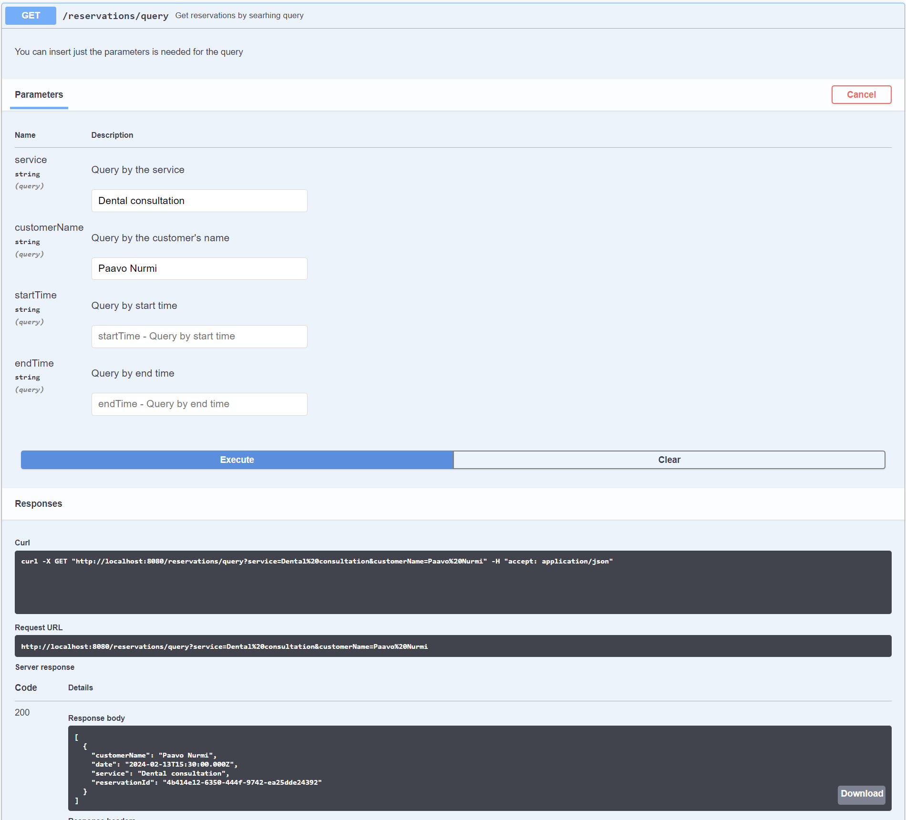

## Modern Software Dev: Mini project 2

22 November 2023

Timo Laakkonen AA4598

<br/>

### Swagger API

#### YAML defining
VS Code with extension Swagger Viewer

  

Packages added:
- uuid: *for generating unique reservationId*
- nodemon: *automatically restarts the server when changes on code are detected*
           
#### Checking the syntax and generate nodejs-server code        
https://editor.swagger.io/


  

**Source code:**    

https://gitlab.labranet.jamk.fi/AA4598/swagger/-/tree/main/YAML/dentist.yaml

**nodejs-server code generated by editor.swagger.io:**

https://gitlab.labranet.jamk.fi/AA4598/swagger/-/tree/main/nodejs-server-server-generated

- Added in-memory json database and code to handle endpoints for more realistic responses

```
npm run dev
```

### Testing the API 
#### Starting view


#### Adding a new reservation


#### Getting all reservations   


#### Getting a reservation by id   


#### Updating a reservation by id   


#### Partially updating a reservation by id   


#### Getting a reservation by id 


#### Deleting a reservation by id 


#### Quering the reservations by service


#### Quering the reservations by service and name of customer


#### Quering the reservations by startTime
Quering the all reservations from startTime to the end


#### Quering the reservations by endTime
Quering the all reservations from the start to endTime


#### Quering the reservations between startTime and endTime

